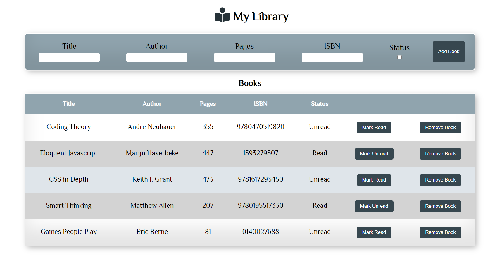

# My Library

## Table of Contents

* [About the Project](#about-the-project)
* [Built With](#built-with)
* [Getting Started](#getting-started)
* [Contributing](#contributing)
* [Author](#author)
* [Acknowledgements](#acknowledgements)

## About Project

My Library is a mini book library project tha allows a user to add books, remove a book and track read status of a given book. The project works with ```localStorage``` for its backend.



## [Live Demo](https://lameck1.github.io/Library/)

## Built With

* HTML5
* CSS
* Javascript

## Getting Started

* Clone this repo <https://github.com/Lameck1/Library>

    ```bash
    git clone https://github.com/Lameck1/Library.git
    ```

* Navigate to Library folder/directory

    ```bash
    cd Library
    ```

* Open the index.html file in the directory to interact with the project

## Contributing

Contributions, issues, and feature requests are welcome!

Feel free to check the [issues page](https://github.com/Lameck1/Library/issues)

## Author

👤 **Lameck Otieno**

* GitHub: [@githubhandle](https://github.com/Lameck1)
* Twitter: [@twitterhandle](https://twitter.com/lameck721)
* LinkedIn: [LinkedIn](https://www.linkedin.com/in/lameck-odhiambo-642b7077/)
* Portfolio: [Portfolio](https://lameck.me)

## Acknowledgements

Credits go to the following for providing guides on JavaScript

* [**MDN Web Docs**](https://developer.mozilla.org/en-US/docs/Learn/JavaScript/Objects)
* [Freecodecamp](https://www.freecodecamp.org/learn/javascript-algorithms-and-data-structures/)

## Show your support

Give a ⭐️ if you like this project!
